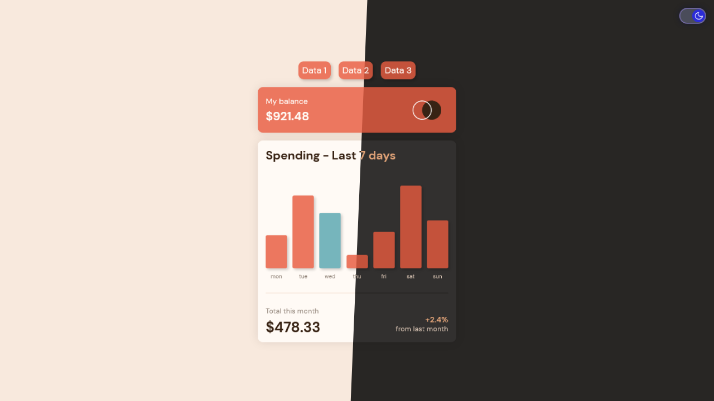

<h1 align="center">Expenses chart component</h1>
<div align="center">

Challenge from [Frontend Mentor](https://www.frontendmentor.io/profile/CodePapa360)

</div>

<h2 align="center">

[🚀Live Site](https://expenses-chart-component-alamin.netlify.app/)
|
[💡Frontend Mentor]()

</h2>

<p align="center">
This is a JavaScript project that displays a chart of daily expenses for a week. It fetches data from JSON files and dynamically updates the chart based on the data. In addition to the original dataset, two more sample data files have been added for demonstration purposes.
</p>

<a align="center" href="https://expenses-chart-component-alamin.netlify.app/">



</a>

## The challenge

Users should be able to:

- View the bar chart and hover over the individual bars to see the correct amounts for each day
- See the current day’s bar highlighted in a different colour to the other bars
- View the optimal layout for the content depending on their device’s screen size
- See hover states for all interactive elements on the page
- **Bonus**: Use the JSON data file provided to dynamically size the bars on the chart
- **Bonus**: Added two more sample data
- **Bonus:** Dark mode toggle

## Built with

- Semantic HTML5 markup
- CSS custom properties
- JavaScript
- Mobile-first workflow
- NPM
- [Webpack - a module bundler](https://webpack.js.org/)

## What I learned

In building this project, I had the opportunity to learn and practice several key concepts in JavaScript. One of the most important concepts that I learned is working with JSON data. I was able to fetch data from external sources in the JSON format, parse the data into a format that is easily readable by JavaScript, and manipulate it to render it on the page.

I also learned how to use JavaScript to perform various calculations and manipulations on data. For example, I was able to find the maximum value in a data set, calculate percentages, and manipulate CSS styles based on the data.

Overall, building this project has greatly improved my understanding of JavaScript and has given me practical experience in building real-world applications using JavaScript.

## Installation

- Clone this repo:

```sh
git clone https://github.com/CodePapa360/Expenses-chart-component.git
```

- Install dependencies:

```sh
npm install
```

- Build command:

```sh
npm run build
```

- Live server:

```sh
npm start
```

## Author

<b>👤 Alamin</b>

- Twitter - [@CodePapa360](https://www.twitter.com/CodePapa360)
- LinkedIn - [@CodePapa360](https://www.linkedin.com/in/codepapa360)
- Frontend Mentor - [@CodePapa360](https://www.frontendmentor.io/profile/CodePapa360)
- Github: [@CodePapa360](https://github.com/codepapa360)

Feel free to contact me with any questions or feedback!

## Show your support

Give a ⭐️ if you liked this project!

## Acknowledgments

Special thanks to Frontend Mentor for providing such an amazing platform to practice and improve my frontend skills. The challenges and projects available on the website were both fun and challenging, and helped me learn a lot in a short amount of time.

## License

This project is licensed under the [MIT](https://github.com/CodePapa360/Expenses-chart-component/blob/main/LICENSE.md) license, which means you can use, modify, and distribute the code as you wish. If you have any questions or feedback, feel free to reach out. Thank you for considering my code!
